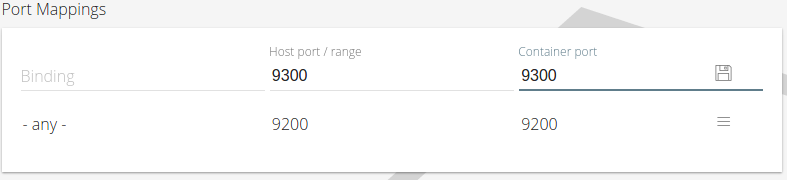

# Define your app in the cloud
The time has come to define our application in the cloud and make it appear in the application library. We have already created our docker containers as well as the configuration files we will need for our app.

## Step 1 - Create a new app
Once you have logged in to the hive, you are able to create your own apps. You can do so by going to the library screen and clicking the + button on the lower right.


You will be asked for an id for your app. Be careful to use only allowed characters [a-z0-9_] within your id. The app id cannot be changed afterwards since it is how we identify the app later on.

## Step 2 - Define general information for your app 

Once your app is created, you will be directed to the app general information panel. Here you can enter a human readable name and description for your app. You can even put in a url to an image to use as a logo.

One thing that is really mandatory is the Git URL, since it will be used to load the configuration from the git repository we created earlier. Also make sure you indicate which architectures your tint supports and which versions of the fabric you want to support. For the latter, you are just fine checking 1.3.

You could change the app visibility to public, but we usually don't do that before the tint has been tested and we know that it works. Otherwise, other people might start using it, even when it is broken.

## Step 3 - Define the containers
Next stop, defining containers. To create a new contianer, you can click on the + sign at the bottom right and select "New Container". You will be presented with a new panel where you can enter the information for the container. 

### General
Start with changing the name of the container (next to the cube icon) to something meaningful. Only use [a-z0-9_] here.


Set the image to the name of the docker container we created earlier. For example, in our case that would be bigboards/elasticsearch. You can forget about the architecture part of the name, since you already indicated which architectures you support. When installing, the system will look at the architecture of the node and append the architecture name to the image name.


We experienced some difficulties when using bridged networking. The problems we experienced had to do with other nodes not being reachable from within the bridged container.

At this point we advice you to use host networking.


### Ports

Usually a container will have some ports it needs to be reachable at. You can enter those ports in the port mappings section. Make sure to press the save button after you have entered the information. You may leave the bindings field empty to bind on all interfaces. Beware that mapping the host port to a different port then the container will only work when using bridged networking, not when using host networking.


 

### Environment Variables

Environment variables can be set using a key and a value. Again, make sure to press the save button to add it to the list.


### Volume Mappings

Volume mappings are an important part of an app since this is where we define which resources from the host are being mounted into the container filesystem. We also use volume mappings to mount the configuration from our git repository into the container filesystem.

The following rule applies:
 - if the host path is a relative path, it is considered to be relative to the git configuration root
 - if the host path is an absolute path, it is considered to be absolute to the host filesystem

So if we would want to mount the _config/elasticsearch_ directory from git into our container filesystem at _/etc/elasticsearch_, we will need to provide the following information:


On the other hand, if we would like to mount the _/data/persistent_fs_ folder on the host filesystem into our container filesystem at _/data_, we would need to do something like this:


**Watch out with persistent volumes since they are not removed when an app is removed. This means that all data stored in them will remain on the cluster, even when the app is removed from it.**

## Step 4 - Define a group
A group defines where a set of containers has to be installed on the cluster. You can add multiple containers to the same group, so it is not unreasonable to have groups like _frontends_, _masters_ or _workers_

You can create a new group using the + button at the bottom right and select _new group_.

As with the container, the first step should be to change the name of the group:


Once that is done, you can continue to the placement expression. This placement expression is actually an ansible pattern and adheres to those rules:

The following patterns are equivalent and target all hosts in the cluster:

```
all
*
```

You can define one or more nodes using one of the following patterns:
```
n1
n2
n3:n4:n5
```

You can also exclude nodes:

```
all:!n1
```

Node names are not the real hostnames of your cluster, since that would break the installation for other people who will very likely not have the same hostnames as you have. Therefor you should use **n_seq_** for addressing nodes. Also watch out when going into the higher regions of node sequences. There are clusters with only 3 nodes, in which case a pattern like n3 or n4:n5 will fail.


The last part of a group definition is the list of containers. You can add a container by entering its name (mind the auto completion) and press the save button to add it to the list


## Step 5 - Define a view
Views make it easy for users to reach out to the technologies installed on a cluster. They are a bit tricky to define right now since you need to get the url right, which can be a hassle sometimes.

You can create a new view in much the same way as you created a group or a container, using the same + button at the bottom right and selecting _new view_. And it comes to no surprise that the first thing to do is to define a name for your new view:


A view is a link to a website, so you need to enter a url in order to address it. Entering a fixed url is also possible, but not very flexible. So in order to make sure the view can always be reached, you can use variables here as well. For example, if you want to reach the node using the ip, you can do the following:

```
{{ nodes[hex.name + '-n1'].ip }}
```

That variable expression will take the hex name, append '-n1' to it and look it up in the nodes dictionary. Once that is done, the (public) ip is returned for that node.


Last but not least, add a description of the view to make it easier for users to know what to expect.

