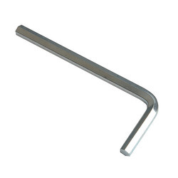
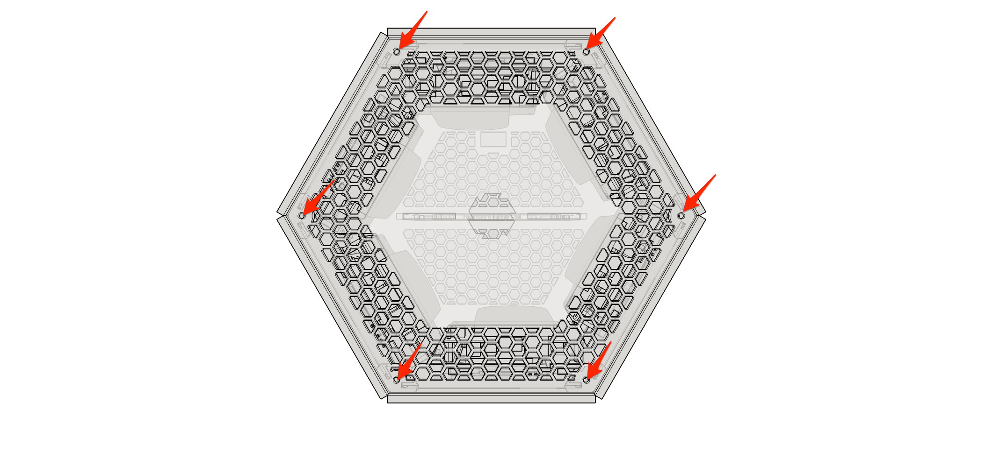
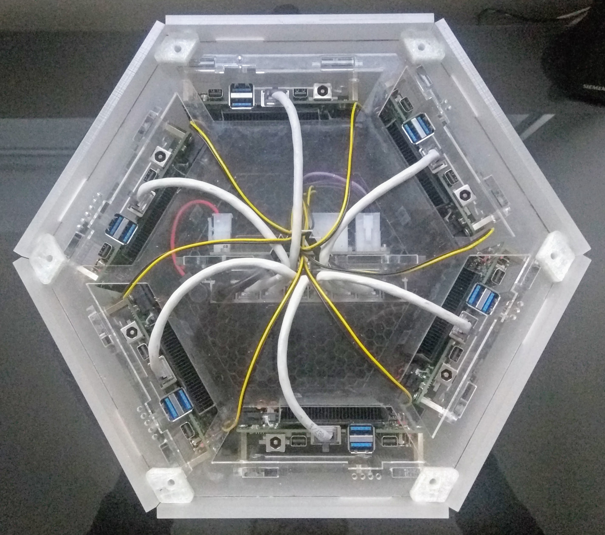
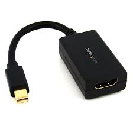

# Attach a screen
If you are ever having hardware problems with your BigBoards device, it can save you a lot of time for debugging purposes to attach a screen and/or a keyboard to any of it nodes.

> **WARNING** 
>
> Unplug the power cable!!!  
> 
> This is an important step! It may seem overly cautious to remove the power cable in addition to powering off the device, but some parts can remain powered even when the device seems to be off. 

## Open the hood
As with any car, you have to pop the hood to get access to your device's internals. 

An adequate allen key was shipped with your device to loosen all the screws of the top cover. 

Carefully lift the top cover of your device. You can use the short side of the supplied allen key to reach through the venting holes.

## Connectors
If you take a look at the connectors under the hood, you'll find these connectors:

1. **Power** 1 x 2.1mm jack as additional connector for power. NEVER TO BE USED!! ... unless your node is removed from the skeleton! 
1. **Network** 1 x RJ45 to attach the node to ethernet network. 
1. **USB** 2 x USB 3.0 connectors to attach screen, mouse ... or even live boot thumb drive if you ever want to install an alternative operating system.  
1. **Display** 2 x mini-DisplayPort to attach a screen, mostly for debugging purposes. You'll probably need a mini-DP to HDMI cable or dongle. 

## Troubleshoot
After opening your device and gaining access to the most important connectors for each node, identify the node that you wish to debug. 

1. Orientate your device with the power and network connectors to the top, i.e. facing away from you.
1. Identify the node to troubleshoort via the nodes number:
    1. the node at the side of the connectors is the 1st node; for a cube the 1st is sitting next to the switch counting clockwise. 
    1. continuing clockwise, you'll find 2 to 6
    1. the skeleton also contains markings per node: 
        1. the top plate has perforations at each node marking its number
        1. the bottom plate the number is simply inscribed at each node 

3. Attach a screen via mini-DisplayPort and keyboard via USB to the identified node
1. Plug network in your Hex
1. Plug power in your Hex to have it boot
1. See on the screen what happens to your node; hit <F2> while booting if you need access to the nodes BIOS.

