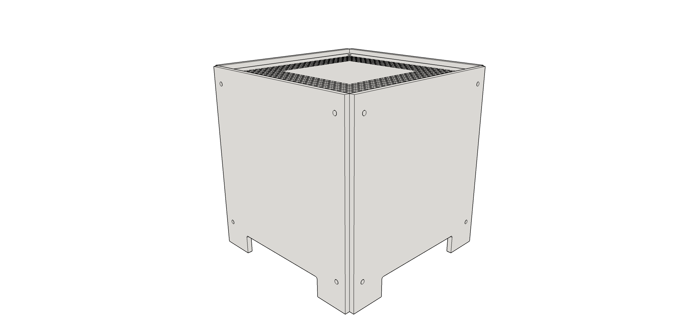
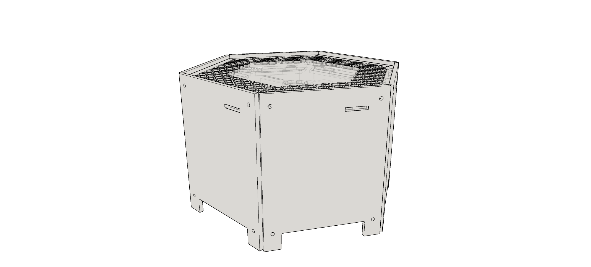

# Hardware
The Hex and Cube are available to fulfill the hardware needs for anyone interested in learning 
and working with data at scale.

Both the Hex and Cube have been built around the popular Intel NUC platform, so both are quite
similar when it comes to the hardware for a single node inside the device. The main difference is
the number of nodes that are inside the device.

A single node inside a device is actually a full computer. It has its own cpu, memory and storage. It
is up to the apps installed on top of these nodes to combine all these separate resources into one
big cluster.

For the Hex as well as the Cube, you can choose between a few node hardware configurations:

 - **CPU**: I3 / I5
 - **Memory**: 8Gb to 16Gb
 - **SSD**: 30Gb SSD for the OS
 - **Disk**: 1Tb - 3Tb HDD for data 

## Models
While the name of the models refers to the shape of the device, it is also an indication to the amount
of nodes inside them.

 - **The Cube** holds 3 nodes with a gigabit interconnect
 - **The Hex** holds 6 nodes with a gigabit interconnect

Both devices have two external network connectors so you can put daisy-chain multiple devices 
together, or you can use one connection for you laptop and have the other one connected to your LAN.

### The Cube

The cube is the newest addition to the bigboards device family. It's a device holding 3 nodes and a
gigabit switch and is ideal to learn and experiment with data technologies like spark or elasticsearch.

### The Hex

The hex is the full fledged, most complete version of our hardware to date. It holds 6 nodes, allowing
you to experiment with more complex setups.