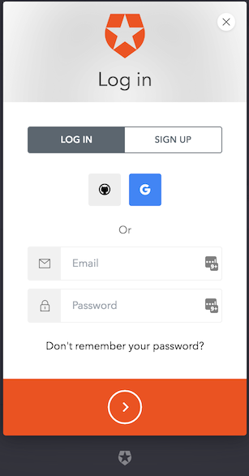
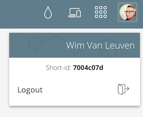

# Hive
The BigBoards Hive is the central nervous system of your micro-cluster, where you can see what [apps](/apps/index.md) can be installed and define your own.

The Hive is hosted at [http://hive.bigboards.io](http://hive.bigboards.io)

You can browse the [library](http://hive.bigboards.io/#/library) anonymously and take a look at all the publicy available install packages, such as [Hadoop](http://hive.bigboards.io/#/library/stack/auth0-572353e3c78da86153049600/bb-stack-hadoop), [Spark](http://hive.bigboards.io/#/library/stack/google-oauth2-103728492012393057640/bb-stack-spark-on-hadoop), [Cassandra](http://hive.bigboards.io/#/library/stack/google-oauth2-104831076958946284701/stack-cassandra), [ElasticSearch](http://hive.bigboards.io/#/library/stack/google-oauth2-103728492012393057640/bb-stack-elasticsearch), ...

## Sign up or Login

To see the full glory of the Hive, it is however better to sign up. Don't worry! It's totally free! 

Click on the key icon in the upper right corner. 

A login/signup dialog as underneath will appear. Complete to either signup or login. We support email/password logins which only belongs to the Hive, but also social authentication using either your Google or GitHub account.

## Your Hive Profile

After you have logged in to the Hive, you can get quick access to your profile. Click on your profile image in the upper right corner. A dropdown will show your details:

To setup clusters and nodes, you might need to provide your profile's short-id. As you can on the screenshot above, you can find that id here.